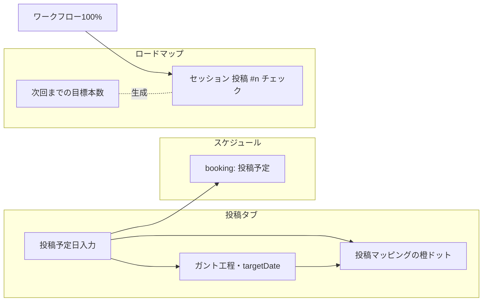

# じょーず（生徒向け）UIガイド — 画面構成とデータのつながり

> **Notionへの入れ方**  
> 1. Notionで新ページを開く → メニュー **⋯** → **インポート** → **Markdown** を選び、このファイルを指定する  
> 2. またはこの文書をコピーしてページに貼り付け（見出しは自動でブロック分割されます）  
> 3. 図は **コードブロック** として貼ってあるので、必要なら `/コード` で **Mermaid** に差し替えるとNotion側でも図として表示できます（プランにより非対応の場合はスクリーンショットを下の「貼り付け枠」に挿入してください）

---

## 1. 生徒が触れる画面の全体像

生徒ログイン時、下部ナビに出るのは次の **5つ** です（タスク・記録・チームはスタッフ用で非表示）。

| タブ | アイコン | 役割 |
|------|----------|------|
| ホーム | 🏠 | 今日の集約・期限・投稿の進捗ショートカット |
| 投稿 | 📊 | 1本ずつの動画ワークフロー＋投稿マッピング（月間カレンダー） |
| ロードマップ | 🗺️ | マイルストーン / スターター / **セッションタスク** |
| スケジュール | 🗓️ | カレンダー・一覧・メモ |
| マイページ | 👤 | 目標・プロフィール・各種設定への入口 |

ホーム内から **チャット**・**相談** などに遷移すると、ナビのハイライトは「ホーム」に寄せた表示になります（`app.js` の `setTab` 仕様）。

### 1.1 画面レイアウト（ワイヤー図）

スマホ縦想定。上部にヘッダ、中央がスクロール、下部が固定ナビ。

```
┌─────────────────────────────┐
│  ヘッダ（タイトル・操作）      │
├─────────────────────────────┤
│                             │
│     メインコンテンツ領域      │
│     （タブごとに切替）        │
│                             │
│                             │
├─────────────────────────────┤
│ 🏠ホーム │📊投稿│🗺️│🗓️│👤  │  ← 生徒向け5ボタン
└─────────────────────────────┘
```

**貼り付け枠（実機スクショ）:** ここにログイン後の画面キャプチャを挿入

---

## 2. タブ別：実際のブロック構成（図解）

### 2.1 ホーム

```
┌─────────────────────────────┐
│ 挨拶・日付・プログラム開始日  │
├─────────────────────────────┤
│ 目標カード / 次の投稿予定     │
├─────────────────────────────┤
│ 今日のタスク・期限・定期     │
├─────────────────────────────┤
│ 投稿予定・進行中投稿の抜粋    │  ← スケジュール・投稿タブへ導線
├─────────────────────────────┤
│ チャット / 相談 など         │
└─────────────────────────────┘
```

**貼り付け枠:** ホーム全体のスクショ

---

### 2.2 投稿タブ（📊）

上から下への並び（実装どおりのイメージ）。

```
┌─────────────────────────────┐
│ （あれば）まとめて記録ボタン   │  ← ワークフロー100%だが未記録の件数
├─────────────────────────────┤
│ ■ 投稿マッピング             │
│   ・予定投稿頻度（目標合計・   │
│     今月の予定日付け済み本数） │
│   ・月間ドット（橙＝予定・    │
│     緑＝完了）                │
├─────────────────────────────┤
│ ＋ 新しい投稿（開始日）       │
├─────────────────────────────┤
│ 投稿 # のピル切替（複数時）   │
├─────────────────────────────┤
│ ■ ガントカード（1本の工程）   │
│   ・タイトル / 期間 → の行     │
│   ・投稿予定日（日付入力）     │  ← カレンダー「投稿予定」と連動
│   ・進捗バー・フェーズ別工程   │
│   ・（100%時）完了日マッピング用│
└─────────────────────────────┘
```

**昨日の仕様整理（説明用）**

- 投稿タブでは **「1本の動画の工程」** を進める場所。  
- **「次のセッションまでに何本」** の本数設定は **ロードマップ → セッションタスク → 各回のカード →「次回まで」** に集約。  
- 長文の説明カードは **表示しない** 方針に変更済み。  
- **予定投稿頻度** は、ロードマップの目標本数の **合計** と、**今月に予定日が入っている本数** を **投稿マッピング** 上で確認できる。

**貼り付け枠:** 投稿タブ（マッピング＋ガント）のスクショ

---

### 2.3 ロードマップ（🗺️）

サブタブが3つ。

```
┌─────────────────────────────┐
│ [マイルストーン][スターター]  │
│      [セッションタスク]       │
├─────────────────────────────┤
│ （選択中のビューの内容）      │
└─────────────────────────────┘
```

**セッションタスク** の各カードでは、例として次のような構造。

```
┌─────────────────────────────┐
│ セッション N 回目 …          │
│ サブ: [タスク][次回まで][MG]  │  ← 並びは実装で固定
├─────────────────────────────┤
│ チェックリスト（課題ライブラリ│
│ ＋ 投稿 #1 #2 …）            │  ← 「次回まで」の本数に応じ生成
│ 右上: 目標本数・進捗         │
└─────────────────────────────┘
```

**連動（実装）:** タイトルが `投稿 #n` のワークフロー投稿が **工程100%** になると、同じ番号のセッション枠タスクに **自動でチェック** が付く（手動で先に付けたチェックを外す動きはしない）。

**貼り付け枠:** セッションカードのスクショ

---

### 2.4 スケジュール（🗓️）

```
┌─────────────────────────────┐
│ [スケジュール] [メモ]        │
├─────────────────────────────┤
│ 月グリッド / 期間一覧         │
│ ・コーチング・講義・投稿予定   │
│ ・セッションタスク（期限付き） │
└─────────────────────────────┘
```

**貼り付け枠:** カレンダー月表示のスクショ

---

### 2.5 マイページ（👤）

子画面として **目標編集**・**プロフィール** などへ遷移（戻るでマイページに復帰）。

**貼り付け枠:** マイページ一覧のスクショ

---

## 3. データの連動（概念図）

投稿まわりで **一本化されているもの** の関係（説明・図解用）。



- **投稿予定日** を入れると: スケジュールに **「投稿予定」** が付き、ガント上部の **期間の終わり（→右）** も同じ日に揃う。空にすると予定は外れ、期間終わりは **開始日＋マイページのペース日数** で再計算。  
- **投稿マッピング** の「予定」は `plannedPublishDate` ベース、「完了」はワークフロー完了日ベース。

---

## 4. 工程（フェーズ）の対応表（参考）

| フェーズ | 含まれる工程の例 |
|----------|------------------|
| 1 企画・台本 | リサーチ、台本、台本添削 |
| 2 制作 | 素材撮影、本撮・アフレコ、テロップ、ジェットカット、編集仕上げ |
| 3 添削・投稿 | 添削依頼・修正、投稿 |

---

## 5. 運用メモ（社内向け）

- 実装のソース: `coaching-mobile/app.js` / `styles.css`。共有用単体HTMLは `build-share.sh` で `jouzu-demo-share.html` を生成。  
- Notionに **実デザイン** を載せるときは、上記「貼り付け枠」に **実機またはデモHTMLのスクリーンショット** を挿入すると、文章＋ピクセル一致の資料になります。

---

*この文書は 2026-04-03 時点のコードベースに基づいて作成しました。*
